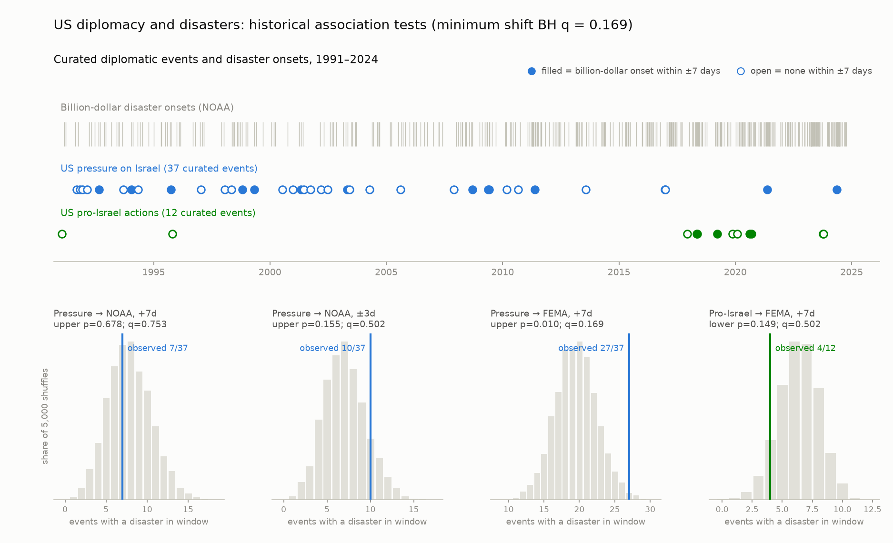

# Israel diplomacy and disaster timing

Historical exploratory test of whether US diplomatic pressure on Israel precedes
more US disaster onsets, with a separately specified deficit hypothesis for the
pro-Israel action list. Biblical and political interpretations remain distinct
from measured disaster timing.

## Current corrected result

Recomputed September 4, 2026 (America/Chicago), using the declared **1991–2024**
historical study period. No circular-shift test survives BH correction across
20 tests; minimum q = **0.1695**. FEMA +7-day pressure association: 27/37 events,
upper-tail p = **0.0104**, q = **0.1695**. Pro-Israel FEMA +7-day deficit test:
4/12 events, **lower-tail p = 0.1491**, q = **0.5021**.

These results do not establish a disaster response to diplomacy, and do not
establish independence. Event selection, limited controls and small samples
remain substantial limitations. Prior July outputs used the wrong upper tail
for the deficit hypothesis; archived results preserve that original run.

[Full generated results](data/test_results.csv) · [Readable run](data/latest_run.txt)



## Reproducible design

- Fixed historical study bounds and catalog coverage live in
  [data/coverage.json](data/coverage.json). NOAA coverage follows its CSV header,
  through December 2024. FEMA is capped to the same historical study period.
  Latest qualifying event onset never determines completeness.
- Pressure hypothesis uses upper tail; pro-Israel deficit hypothesis uses lower
  tail. Both include equality. Five windows: +3/+7/+14 days and ±3/±7 days.
- Events enter a test only if the entire response window lies inside observed
  coverage. The same eligible date interval defines null simulations and baseline
  exposure. All date endpoints are inclusive.
- 20,000 seeded circular shifts preserve event spacing on the eligible date
  circle. Year-shuffle sensitivity preserves month/day and samples only valid
  years, including the final year when its response window is covered.
- Two lists × two datasets × five windows = 20 tests. BH q-values are reported
  separately for shift and year-shuffle nulls. Multiple overlapping windows
  limit interpretation of independence; shifts assume timing exchangeability
  that long-term policy and disaster-rate changes can violate.
- FEMA natural incidents are deduplicated to onset days; NOAA billion-dollar
  weather/climate disasters exclude earthquakes by definition.

## Curation boundary

The existing diplomatic CSVs remain unchanged. Their historical inclusion rules
cover territorial-concession negotiations, public demands, relevant UNSC votes,
and material aid/arms conditions. The pressure list has 37 selected events and
the control has 12. Their per-row primary-source links and decision timestamps
are missing, and neither completeness nor original outcome-blind curation has
been independently established. Political labels compress distinct policies.

This is a frozen historical selection, **not a current diplomacy monitor**.
Extending it requires documented primary sources, publication/decision dates,
issue-specific coding and inclusion reasons recorded before future outcomes.
A disagreement about policy is not itself evidence of religious motive.
The curated [claimed-pairs audit](data/koenig_claimed_pairs.csv) is preserved.

## Run

```bash
python analyze.py
python make_plots.py
python -m unittest discover -s tests -v
bash update.sh
```

`update.sh` refreshes disaster catalogs but never expands curated event lists or
the historical study interval. Figures read generated p/q values rather than
hard-coded conclusions. Source definitions:
[NOAA](https://www.ncei.noaa.gov/access/billions/) and
[FEMA OpenFEMA](https://www.fema.gov/openfema-data-page/disaster-declarations-summaries-v2).
